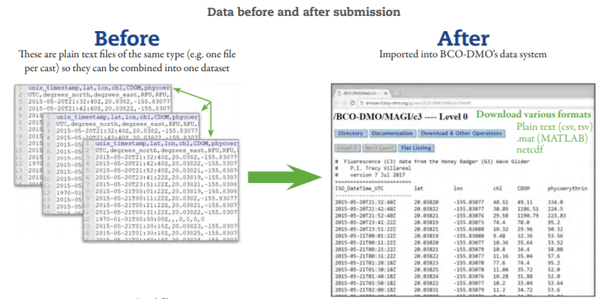

# What is a Dataset?

## The BCO-DMO Dataset

At BCO-DMO, a dataset is thought of as a logical collection of information. Most often, data are organized into columns and rows in a spreadsheet or table. However, a dataset could also be a collection of images or modeling input and code. Usually, one dataset will have been produced as a result of a specific sampling event or series of events, from a particular instrument or group of instruments.&#x20;

A BCO-DMO dataset usually contains one data table (example formats: csv, Excel, tsv) or a collection of files that contain the same type of data, like a collection of model output files in .netcdf format or a collection of coral quadrat photos.

Examples of datasets:

* CTD data from one cruise;
* CTD data from several cruises that have been processed and analyzed in the same way;
* Water quality parameters collected by hand using a multimeter, handheld fluorometer, and nitrate sensor from the same location, such as a pier, over a period of time;
* Species names, sampling locations and dates, and specimen size and sex determined using a microscope from samples collected by various nets during several cruises pertaining to a research project;
* Trace metal concentrations in water samples collected by Niskin bottles, McLane pumps, and ice corers deployed during a cruise;
* Water biogeochemistry determined using several instruments from samples collected at sea, along with NCBI accession numbers of sequences obtained from biological samples collected at those same locations during the cruise;
* Carbonate system parameters and oyster growth measurements resulting from a laboratory experiment on ocean acidification.
* A collection of images resulting from a model, along with the input files, and model code would constitute a BCO-DMO dataset.

**One dataset does not necessarily equate to one data file**. A dataset may be made up of multiple data tables with the same organizational structure that are combined into one by the data table manager.

<figure><figcaption>
One dataset from multiple data files. 
</figcaption></figure>

A single dataset is described by metadata presented within one BCO-DMO Dataset Landing Page. Therefore, submissions that describe different types of acquisition methods, processing methods, or parameters, or that were produced by different projects/awards would likely not be a single BCO-DMO dataset.

## Dataset Types

BCO-DMO manages a wide variety of data types and formats. Contents of the datasets change depending on the subject, but the following information is required for every dataset for improved reusability of that dataset:&#x20;

* Dates,  times, and timezone
* Location information (latitude and longitude)&#x20;

**Tabular data** with biological and chemical oceanographic data from in-situ measurements during cruises or field sampling, sediment samples, lab experiments, etc. make up the bulk of the BCO-DMO data holdings. Details on the supported format and organiztion of tabular data can be found [here](../data-submission/organizing-data-tables.md).  &#x20;

**Models, Software, & Code** are rapidly emerging data types, with few community templates or formalized structures. Guidelines that BCO-DMO is using to standardize these data submissions can be found [here](../data-submission/software-and-code.md).

**GEOTRACES data** submitted to BCO-DMO need to follow a program-specific template. Details on data submission complying with the requirements of the GEOTRACES program can be found [here](../data-submission/geotraces.md).&#x20;

**Genetic Accessions**: Genetic data are primarily curated in the domain-specific repository NCBI ([https://ncbi.nlm.nih.gov/](https://ncbi.nlm.nih.gov/)). However, BCO-DMO serves the metadata related to the genetic accessions, using the specific identifier as a way to relate the data in NCBI and BCO-DMO. Specific information on this data type can be found [here](../data-submission/genetic-accessions.md).&#x20;

**Image Classification Data**

## Metadata

Each dataset needs to be accompanied by metadata in order for a user to understand and effectively reuse the data. Therefore, each dataset needs to have its own metadata page, specifically describing how the data were generated.

Gathering the necessary metadata for a specific dataset can feel cumbersome, but a robust [data management plan](data\_management\_plan.md) at the start of the project can help alleviate the burden.&#x20;

Metadata consists of detailed acquisition and processing descriptions, including a description of all instruments used, parameter descriptions, funding, investigator names and contact information, as well as links to related datasets and publications. [Here](../data-submission/metadata-for-datasets.md) is the full list of the necessary metadata for a BCO-DMO dataset.&#x20;

