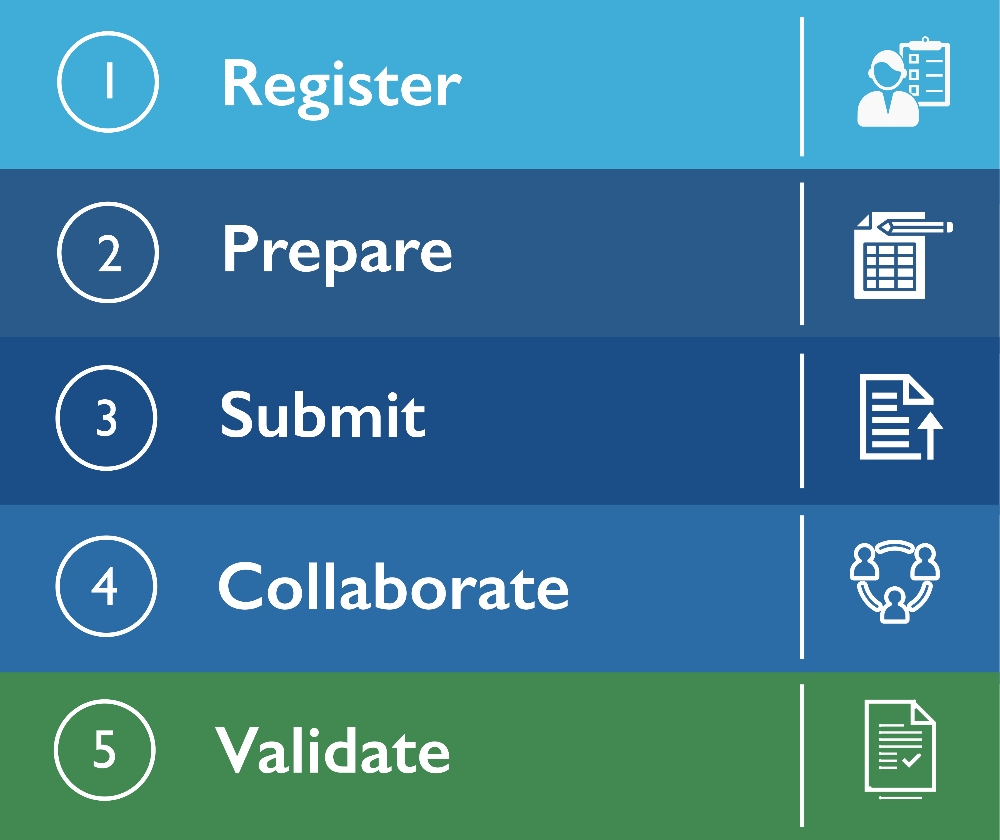

# Data Sharing Expectations & Processes

By submitting your data to BCO-DMO, you are engaging in a collaborative process with our Data Managers to curate and publish your project's output. This is typically an iterative process where we may reach out to you with questions or requests for more information. Your patience and cooperation are greatly appreciated. Our "hands-on" curation process results in well-described datasets that are accessible during the manuscript review process and available for reuse by the scientific community. Depending on the complexity or volume of the data and the quality of the metadata we receive, this process can be time-intensive.&#x20;


**We therefore** **recommend "research-ready" (i.e., processed, quality-controlled, and well-described) data be submitted to us as early as possible and well in advance of any reporting or publication deadlines.**&#x20;


### Our Curation Process

Every dataset we receive is reviewed, processed, and published by a BCO-DMO Data Manager. Our curation process includes gross QA/QC (e.g., checking observational metadata such as position, date, and time; identifying inconsistencies in data, etc.), conversion of data files to open formats, and the application of standard vocabularies, formats, and conventions (e.g., position in decimal degrees, dates in ISO 8601, etc.) In some cases, our Data Managers may suggest alternate ways of organizing your data to make them more useful, such as combining like data tables. In addition to working with the data files themselves, we also strive to develop robust metadata records for every dataset to ensure data are easily discoverable and reusable. Once finalized, every BCO-DMO dataset is archived and assigned a Digital Object Identifier (DOI), allowing the originators and subsequent users to easily cite research products. Through our curation process, we publish data in accordance with both the [NSF OCE Data Policy](https://www.nsf.gov/pubs/2024/nsf24124/nsf24124.jsp) and [FAIR data principles](https://www.go-fair.org/fair-principles/).&#x20;

### Data Submission Workflow

When sharing results associated with a forthcoming publication, **we strongly recommend that you submit the data to us before you begin writing the manuscript** to allow sufficient time for us to curate the datasets and publish them with DOIs you can cite in your paper. We also recommend that you familiarize yourself with the data-sharing policies of the journal you're submitting to so we can help you meet those requirements.&#x20;

Below is an overview of the typical workflow from project registration to data publication at BCO-DMO.

<figure><figcaption>
These steps are described below.
</figcaption></figure>

### **1. Register**&#x20;

_**Register your project:**_ Please register your NSF-funded project with us as soon as the proposal has been recommended for funding. Collaborative Research projects only need to be registered once as the resulting BCO-DMO project page will identify all of the related awards, PIs, and Co-PIs.&#x20;

Please see the "[Project Registration](contribute/project-registration.md)" page for instructions on how to register your project.


⏱️ **Timeline:** Once we receive a project registration through our Submission Tool, the project page is typically published online within two business days.&#x20;


### 2. Prepare

_**Prepare data and metadata:**_ After project registration, many months or years may elapse during which you're conducting research and generating data. During this time, it's important to document your methods and procedures and to begin organizing your data in ways that will help enable reuse.&#x20;

Please see the "[Data Table Organization](prepare/organizing-data-tables.md)" page for tips on organizing your data and the "[Metadata for Datasets](prepare/metadata-for-datasets.md)" page for a description of the types of metadata you should capture.

### 3. Submit

_**Submit data and metadata:**_ Data may be submitted to BCO-DMO at any time during the project. We encourage you to submit data whenever a dataset is considered "research-ready" (i.e. it has been processed, quality controlled, and is ready for analysis).&#x20;

Please see the "[Submitting Data with Submission Tool](contribute/submitting-data-with-submission-tool.md)" page for instructions on how to submit data to us.


⏱️ **Timeline:** Once we receive your data through our [Submission Tool](http://submit.bco-dmo.org), you'll receive an email response from a Data Manager within two business days confirming receipt and letting you know what the next steps are.&#x20;

We typically process datasets in the order they are received, and we oftentimes have a submission queue, meaning **it may be several days or weeks before we can actively begin working on your submission**. This is why we encourage early submission of data. Please keep in mind the submission queue is generally longer around NSF proposal deadlines.


### 4. Collaborate&#x20;

_**Work collaboratively with a data manager:**_ After we accept your data and metadata, and when your submission is next in the queue, a BCO-DMO Data Manager will work with you to process and publish your datasets. Your Data Manager will contact you with follow-up questions or requests for more information throughout this curation process.&#x20;

If we need more information from you and do not receive a response, your submission will remain on pause until we hear from you. We do not publish datasets if we have unresolved questions about the data or metadata.&#x20;


⏱️ **Timeline:** This portion of the process may take anywhere from one day to several weeks, depending on the number of datasets involved and the frequency of communication between you and the Data Manager. Your timely attention and communication can help shorten processing times.&#x20;


### 5. Validate

_**Review and approve draft datasets:**_ Once your draft dataset pages have been created, you’ll be asked to review the data and metadata for completeness and accuracy. This validation stage is the final step in the process, and it is necessary for the assignment of DOIs and long-term archiving. Again, your timely attention and response will expedite this process.


⏱️ **Timeline:** Once you provide final approval of the draft pages, we can archive and DOI your data right away.

