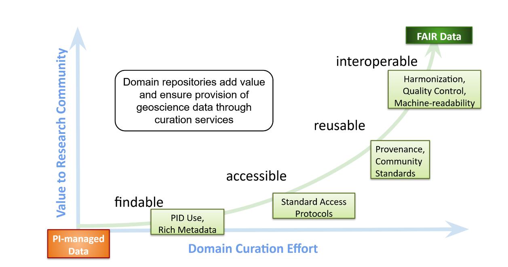

# Submitting Data

Note this page is still under construction.

## How to Submit Data

After clicking the "Submit a new dataset" button from the [Submission Tool dashboard](https://submit.bco-dmo.org/), you'll be taken to a series of forms where you'll enter your metadata and then upload data files. Each field has instructions and examples. Below is further information about how to complete each field.

### Request Data Restriction (Embargo) 

At the top of the "Overview" section, you'll see a checkbox where you can indicate if you'd like the dataset to be restricted/embargoed. If you click this checkbox, you'll then see a field where you can enter the desired public release date for the dataset. Select the release date using the calendar drop-down.&#x20;

Please be aware of your funder policies about data sharing and any policies established by journals you plan to publish in. The [NSF OCE Data Policy](https://www.nsf.gov/pubs/2017/nsf17037/nsf17037.jsp), for example, requires data to be made publicly available no later than two years after collection. Certain journals may also require your data to be publicly available for the peer-review process.&#x20;

<figure><figcaption>
screenshot of the restricted data and release date options
</figcaption></figure>

### Dataset Name 

**Instructions**: Enter your preferred name for the dataset. It should be short, but descriptive. Your data manager will use this to construct a dataset title.&#x20;

**Examples:**

> CTD Profiles from the RR1805 cruise in April 2018\
> Ammonia and Urea-derived-N Oxidation Rates \
> 2014 Antarctic krill feeding experiments \
> Kimbe Bay connectivity model results \
> AT42-05 sediment geochemistry \
> Salp genome and transcriptomes&#x20;

### Abstract 

**Instructions**: Provide an abstract that describes your data. In terms of length and level of detail, your dataset abstract should be similar to an abstract you might write for a publication. Avoid using an award or paper abstract with information not related to the exact data you are submitting to BCO-DMO. It should describe the _what, where, when, why, how_, and _who_ of the specific dataset you're submitting. If relevant, describe how the data are related to any larger studies and how the data might be of interest to the science community.

* **What -** A description of what has been recorded and what form the data take. This should immediately convey to the reader precisely what the resource is.
* **Where -** A description of the spatial coverage, whether the coverage is even or variable.
* **When -** The period over which data were collected.
* **How -** A _brief_ description of the methodology. (Detailed methodology and can be provided in other parts of the metadata.)
* **Why -** For what purpose was the data collected? And who is likely to find the data useful?
* **Who -** The party/parties responsible for the collection and interpretation of data.

**​Example 1:**

> Despite their importance for research and environmental protection, there**'**s still a shortage of high quality and high-resolution temperature, pH, and oxygen data, particularly in shallow coastal habitats. We monitor five important environmental parameters (i.e., depth, temperature, salinity, pH, and dissolved oxygen) at 30 minute intervals in Mumford Cove, CT (41°19'25"N 72°01'07"W), a small (2 km × 0.5 km), shallow (1-5m), cone-shaped embayment opening to northeastern Long Island Sound, with protected marsh habitat along its western side, marsh and beach habitat along its eastern side, and an extensive seagrass (_Zostera marina_) cover. Continuous monitoring is achieved by swapping identical and recalibrated probes (Eureka Manta Sub2) every 3-5 weeks.

### Project

**Instructions**: Enter the complete project name as shown by your funder or provide a link to the BCO-DMO Project landing page.

**Examples**:

> Connecting Trace Elements and Metalloenzymes Across Marine Biogeochemical Gradients
>
> [https://www.bco-dmo.org/project/2236](https://www.bco-dmo.org/project/2236)

### Funding

**Instructions**: Enter the award number(s) that funded this dataset. If an NSF award, include the three-letter prefix that indicates the funding directorate.

**Example**:

> OCE-1435056, OCE-1436694

### Keywords

**Instructions**: Enter keywords for your dataset (optional). We suggest 3-5 keywords but you can provide more or less.&#x20;

**Example**:

> ocean acidification, coral reefs, calcification

### **Questions & Comments**

**Instructions**: Add any further information you would like us to know about your submission. We will answer any questions you have when we review your submission.

#### After filling in the above fields, click "Save and continue" at the top of the page to move to the People section.

### People

**Instructions:** Identify all people associated with this dataset. The name and ORCID iD you used to log in will be displayed. Fill in your email address and phone number. Select your role from the drop-down list. Enter your current affiliation (institution or organization name) and your affiliation at the time of data collection.

To add additional people, click "+ Add person" and then click "Edit". Use the "ORCID Search" at the top of the edit window to search by name or ORCID iD and then fill in the rest of their information and roles on the project, and, once complete, click "Update" at the bottom of the screen. If the person doesn't have an ORCID iD, we suggest they create one, but it is not required. Anyone added here with an ORCiD will be able to view the submission and will be able to edit it when in draft state.

Note that we do not publish your email or phone number. They are for internal BCO-DMO use only.

<figure><figcaption>
The edit screen for adding people to a project. Note the ORCID search button at the top.
</figcaption></figure>

Any required information that's missing will be displayed in red:

<figure><figcaption>
Required fields that are empty will be displayed in red.
</figcaption></figure>

#### After filling in **all of the People information**, click "Save and continue" at the top of the page to move to the Location section.

### Location

**Instructions**: Provide a general description of the study area.

**Example**:

> Sub-Antarctic waters (48 S, 173 E) depth 2369m

### Cruise or Deployment

**Instructions**: List identifying **cruise or deployment information** here. If the data were collected on a research cruise, mooring, or another field deployment, include as much of the following as is relevant:&#x20;

* vessel name,&#x20;
* cruise ID, mooring ID, or other identifier,
* cruise name (nickname) or alternate identifiers,
* start and end dates,&#x20;
* location,
* Chief Scientist name and contact information,&#x20;
* coordinated platforms/deployments
* Rolling Deck to Repository (R2R) link (for UNOLS vessels only)

**Example of research cruise information:**

> R/V Kilo Moana KM1128 "METZYME" cruise; Oct 1 to Oct 25, 2011; Chief Scientist - Karl Lamborg (WHOI, clamborg@whoi.edu); [https://www.rvdata.us/search/cruise/KM1128](https://www.rvdata.us/search/cruise/KM1128)

**Other** **Examples**:&#x20;

> Day-trips aboard an 18-foot powerboat conducted once per week in Buzzards Bay, MA during June-October, 2016-2019.
>
> CTD casts conducted daily from the Santa Monica Pier, CA during July and August 2018.

### Geospatial Extent

**Instructions**: Provide the geospatial extent (**latitude and longitude** bounding box) of the dataset, if applicable. If latitude and longitude are provided as values in your data file(s), you can skip this section. Decimal degree format (North and East are positive) is preferred.

**Example**:

<figure><figcaption>
Example of geospatial extent
</figcaption></figure>

### Temporal Bounds

**Instructions**: Provide the **start and end time range** for the dataset. If dates are included as values in your data file(s), you can skip this section.&#x20;

Include the time range you think is most relevant for your data, whether that includes both the sample collection date and the date measurements were made on those samples or just the sample collection date itself.

ISO8601 format is preferred (YYYY-MM-DD). If you only know the year and month, that can be entered as YYYY-MM.&#x20;

**Example**:

<figure><figcaption>
Example of temporal bounds
</figcaption></figure>

#### After filling in **all of the information in the Location section**, click "Save and continue" at the top of the page to move to the Methods section.

### Methods & Sampling

**Instructions**: Provide **detailed** methods for sample collection and analyses, including references. Consider the following: filter type, pore size, wash protocols, storage of sample before determination (time, conditions), sample preparation, treatment descriptions, and specific changes from any published methodologies mentioned. Include a description of data processing and any software products that were used, including version numbers if available. \
\
"See methodology in results publication" is insufficient. If citing the methodology section of a results publication, please provide a methodology summary in addition to the citation.\
\
**Examples:**&#x20;

> TBD

### Instruments

**Instructions**:  Provide the names and descriptions of all **equipment and instrumentation** used in sample collection and analyses. Include manufacturer names and model numbers where relevant and calibration information for individual sensors. If you have calibration files you can upload them in the Files section along with a description of the calibration file.\
\
**Examples**:

> 8 L X-Niskin bottles: Dissolved seawater samples were collected using a 12-bottle trace metal clean rosette equipped with 8 L X-Niskin bottles.
>
>
>
> Metrohm 663 VA and µAutolabIII system: Dissolved Co was measured using a Metrohm 663 VA and µAutolabIII system equipped with a hanging mercury drop working electrode.
>
>
>
> A Retsch Mixer Mill 200 was used for homogenization.

### Data Processing

**Instructions:** **Describe the processing** performed to arrive at the data you are submitting. Include any software products that were used including version numbers if available. If you have associated code to share, you can upload the code files or provide a remote repository link.  \
\
**Do not** include subsequent processing (e.g. statistics, graphs) used to analyze the data. If you would like to include that information, please upload it to the files section as a supplemental document or, if described in a publication, provide a citation under Related Publications.\

**Examples:**&#x20;

> TBD

### Problems/Issues

**Instructions**: List any known problems associated with the dataset,  such as gaps in sampling, instrument malfunction, software errors, etc. Include information about any quality flags used.\
\
**Example**:

> Some dissolved cobalt values reported are suspected misfires, and are accordingly labeled with a QC flag of 3. See flag definitions at: [https://www.geotraces.org/geotraces-quality-flag-policy/](https://www.geotraces.org/geotraces-quality-flag-policy/)&#x20;

### Related Publications

#### **Results Publications**

\
**Instructions**: Provide the full reference to publications that used these data. Include DOIs for the publications if they exist. If this dataset was published as a particular table or plotted in a figure, please provide the table and figure numbers.

#### **Methods References**

**Instructions:** Provide the full reference to publications cited in your metadata. Include DOIs for publications if they exist.

#### Related Datasets

**Instructions:** Please describe any closely related datasets and describe how they are related. Please provide links to where the related data can be found. Only list closely related datasets here such as data that was collected as part of the same experiment, used the same samples, or was generated concurrently. Note that other datasets in the same project can be found from the Project Landing Page.

**Examples:**&#x20;

> TBD

\
After filling in **all of the information in the Methods section**, click "Save and continue" at the top of the page to move to the Parameters section.

### Parameter names, descriptions, units

**Instructions**: Parameter names are the column headings in your dataset. If these are not fully explained in the data files (with definitions and units), provide definitions and units here for every data column.

Please include limits of detection, precision, any inter-calibration information, use of international standards, etc. if relevant. Include the missing data identifier(s) used to indicate "no data" (e.g. -999, NaN, nd). Remember to provide the time zone.

If you'd prefer to provide your parameter descriptions in a separate file, please use [parameters\_template.csv](https://submit.bco-dmo.org/static/files/parameters\_template.csv) and upload this file in the file upload section. Refer to [parameters\_example\_porewater-geochem.csv](https://submit.bco-dmo.org/static/files/parameters\_example\_porewater-geochem.csv) as an example.\
\
**Example**:

> Site = Site number (1, 2, or 3); three sites were cored in the high marsh; unitless. \
> Location = Location number (1, 2, or 3); at each of the three sites, two high marsh cores and one inundated pond core were collected; unitless. \
> Core ID = The two marsh cores were labeled 1 and 2; unitless.\
> Depth = Depth of horizon relative to surface of the marsh; centimeters (cm).\
> Time = Time during ramped pyrolysis oxidation experiment; h:mm:ss AM/PM. \
> Temperature = Temperature of oven during ramped pyrolysis oxidation; degrees Celsius. \
> CO2 = Carbon dioxide evolved; per mil (0/00).\
> \
> NaN = no data value\
> BDL = below detection limit

#### After filling in **all of the information in the Parameters section**, click "Save and continue" at the top of the page to move to the Files section.

### **Files**

**Instructions:** Upload all files related to this submission (data files and supporting information, such as images, statistical tables, or instrument calibration reports). If you need help submitting a large dataset, please email [info@bco-dmo.org](mailto:info@bco-dmo.org) to coordinate your file transfer.
